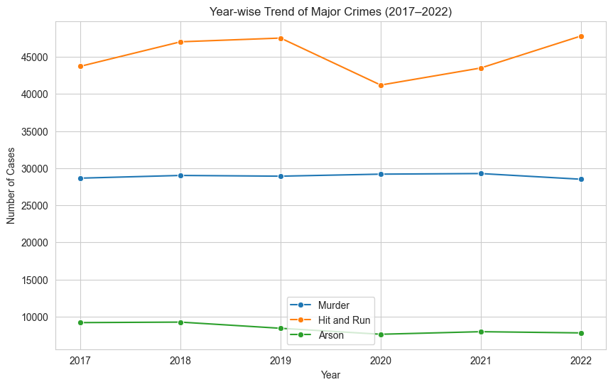

# 📊 Exploratory Data Analysis of District-wise IPC Crimes in India (2017–2022)

**Python | Data Analysis | Exploratory Data Analysis | Data Visualization**

---

## 📌 Project Overview

This project performs an **Exploratory Data Analysis (EDA)** of district-wise **Indian Penal Code (IPC) crime data** across India from **2017 to 2022**.

The objective of this analysis is to uncover meaningful insights by examining:

* Crime trends over time
* High-crime districts and states
* Relationships between different crime categories
* Distribution of crimes across geographic regions

Using Python-based data analysis tools, the dataset is cleaned, processed, and visualized to identify patterns and trends in crime statistics.

---

## 📂 Dataset

The dataset contains **district-wise IPC crime records in India**.

**Source**

* National Crime Records Bureau (NCRB)
* Open Government Data Platform India

**Dataset Details**

* 📄 Records: **5322**
* 📊 Columns: **124**
* 📅 Time Period: **2017–2022**
* 📍 Level: **District-level crime statistics**

Important attributes include:

* `state_name`
* `district_name`
* `year`
* various IPC crime categories such as murder, theft, arson, assault, etc.

---

## 🛠 Technologies Used

### Programming Language

* Python

### Libraries

* Pandas
* NumPy
* Matplotlib
* Seaborn

### Environment

* Jupyter Notebook

---

## 🔎 Data Analysis Workflow

The analysis was conducted through several stages:

### 1️⃣ Data Loading

The dataset was imported using **Pandas** and examined to understand its structure.

### 2️⃣ Data Cleaning

Preprocessing steps included:

* Removing columns with excessive missing values
* Handling missing values using **median imputation**
* Removing duplicate records
* Filtering invalid numerical values

### 3️⃣ Feature Engineering

A new variable **`total_crimes`** was created by aggregating crime-related numerical columns.

### 4️⃣ Exploratory Data Analysis

Multiple analytical techniques were applied:

* Trend analysis
* Geographic crime analysis
* Distribution analysis
* Correlation analysis

---

## 📈 Key Analysis Performed

### 1️⃣ Year-wise Trend Analysis of Major Crimes

Examined trends for:

* Murder
* Hit-and-run incidents
* Arson

Results showed that **violent crimes remained relatively stable between 2017–2022**, with minor fluctuations.

---

### 2️⃣ Top Districts with Highest Crimes

Districts with highest crime totals:

* Mumbai
* North West (Delhi)
* Pune
* Hyderabad
* Chennai
* Bengaluru Urban
* Ahmedabad
* South West (Delhi)
* Ernakulam
* Surat

These are **major metropolitan districts** with high population density.

---

### 3️⃣ Top States with Highest Crimes

States with highest crime totals include:

* Uttar Pradesh
* Maharashtra
* Tamil Nadu
* Madhya Pradesh
* Delhi
* Rajasthan
* Gujarat
* Bihar
* Kerala
* West Bengal

These states contain **large urban populations**.

---

### 4️⃣ State-wise Crime Heatmap

A heatmap was used to compare crime levels across states.

It revealed **uneven crime distribution across India**.

---

### 5️⃣ Crime Distribution in a Selected State

Analysis was performed for a selected state to identify dominant crime types.

Common crimes included:

* Other IPC crimes
* Theft-related offences
* Assault-related crimes

---

### 6️⃣ Correlation Between Crime Categories

A correlation matrix was used to examine relationships between crime types.

Results showed **moderate correlations between some crime categories**.

---

### 7️⃣ Crime Distribution Analysis

Histogram and pie chart visualizations were used to examine crime distribution.

Key observations:

* Most districts report **lower violent crime counts**
* A few districts show **significantly higher crime levels**

---

## 📊 Key Insights

Important findings from the analysis:

* Violent crime levels remained **relatively stable from 2017–2022**
* **Urban districts recorded higher crime totals**
* Property crimes and interpersonal conflicts represent a **large share of crimes**
* Crime distribution across India is **uneven**

---

## 🖼 Visualizations

The project includes multiple visualizations:

* 📈 Line Charts
* 📊 Bar Charts
* 🔥 Heatmaps
* 📉 Histograms
* 🥧 Pie Charts

These visualizations help illustrate crime patterns and regional trends.

---

## 📁 Project Structure

```
ipc-crime-data-analysis
│
├── data
│   └── districtwise-ipc-crimes-2017-onwards.csv
│
├── notebook
│   └── crime_analysis.ipynb
│
├── report
│   └── crime_analysis_report.pdf
│
├── images
│   ├── crime_trend.png
│   ├── top_states.png
│   ├── heatmap.png
│   ├── correlation.png
│   └── distribution.png
│
└── README.md
```

---

## 🚀 Future Scope

Possible improvements include:

* Machine learning models for **crime prediction**
* **Geospatial crime analysis using GIS**
* Integration of **socioeconomic data**
* Interactive dashboards using **Tableau / Power BI / Streamlit**

---

## 👨‍💻 Author

**Nishant**

B.Tech Computer Science and Engineering
(Data Science Minor)

Lovely Professional University

---

## 📜 License

This project is intended for **educational and research purposes**.

---

### Important Tip

After uploading README:

Add **graph screenshots** inside an `images` folder and include them like this:

```

```

This makes the repo look **10× better**.

---

If you want, I can also show you **how to make your GitHub profile look strong for placements in just 20 minutes (very useful before campus placements start)**.
